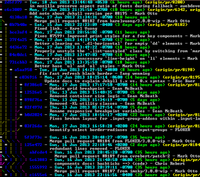

 **Инструкция по работе с системой контроля версий Git**
=========================================================

## Инициализация репозитория

Чтобы инициализировать новый репозиторий используйте комманду : 

    git init

Эта команда создаёт в текущем каталоге новый подкаталог с именем **.git**, содержащий все необходимые файлы репозитория — структуру _Git_ репозитория. На этом этапе ваш проект ещё не находится под версионным контролем. 

## Прверка состояния репозитория

Основной инструмент, используемый для определения, какие файлы в каком состоянии находятся — это команда :

    git status

Вывод команды `git status` довольно всеобъемлющий и многословный. _Git_ также имеет флаг вывода сокращенного статуса, так что вы можете увидеть изменения в более компактном виде. Если вы выполните 

    git status -s 

или 

    git status --short 

вы получите гораздо более упрощенный вывод.

Чтобы увидеть, что же вы изменили, но пока не проиндексировали, наберите 

    git diff

Эта команда сравнивает содержимое вашего рабочего каталога с содержимым индекса. Результат показывает ещё не проиндексированные изменения.

Если вы хотите посмотреть, что вы проиндексировали и что войдёт в следующий коммит, вы можете выполнить 

    git diff --staged. 

Эта команда сравнивает ваши проиндексированные изменения с последним коммитом.
Важно отметить, что `git diff` сама по себе не показывает все изменения сделанные с последнего коммита — только те, что ещё не проиндексированы. 

## Добавление версионности

Для того чтобы начать отслеживать (добавить под версионный контроль) новый файл, используется команда :

    git add

## Фиксация изменений

Теперь, когда ваш индекс находится в таком состоянии, как вам и хотелось, вы можете зафиксировать свои изменения. Запомните, всё, что до сих пор не проиндексировано — любые файлы, созданные или изменённые вами, и для которых вы не выполнили `git add` после редактирования — не войдут в этот коммит. Они останутся изменёнными файлами на вашем диске. В нашем случае, когда вы в последний раз выполняли `git status`, вы видели что всё проиндексировано, и вот, вы готовы к коммиту. Простейший способ зафиксировать изменения — это набрать :

    git commit

Эта команда откроет выбранный вами текстовый редактор.

Вы можете видеть, что комментарий по умолчанию для коммита содержит закомментированный результат работы команды `git status` и ещё одну пустую строку сверху. Вы можете удалить эти комментарии и набрать своё сообщение или же оставить их для напоминания о том, что вы фиксируете.

Когда вы выходите из редактора, _Git_ создаёт для вас коммит с этим сообщением, удаляя комментарии и вывод команды `diff`.

Есть и другой способ — вы можете набрать свой комментарий к коммиту в командной строке вместе с командой `commit` указав его после параметра `-m`.

    git commit -m "done homework"

Несмотря на то, что индекс может быть удивительно полезным для создания коммитов именно такими, как вам и хотелось, он временами несколько сложнее, чем вам нужно в процессе работы. Если у вас есть желание пропустить этап индексирования, _Git_ предоставляет простой способ. Добавление параметра `-a` в команду `git commit` заставляет _Git_ автоматически индексировать каждый уже отслеживаемый на момент коммита файл, позволяя вам обойтись без `git add` :

    git commit -a -m 'done homework'

## Просмотр истории коммитов

После того, как вы создали несколько коммитов или же клонировали репозиторий с уже существующей историей коммитов, вероятно вам понадобится возможность посмотреть что было сделано — историю коммитов. Одним из основных и наиболее мощных инструментов для этого является команда :

    git log

Команда git log имеет очень большое количество опций для поиска коммитов по разным критериям. Рассмотрим наиболее популярные из них.

Одним из самых полезных аргументов является `-p` или `--patch`, который показывает разницу (выводит патч), внесенную в каждый коммит.Условно показывает `diff` для каждого. Так же вы можете ограничить количество записей в выводе команды; используйте параметр `-2` для вывода только двух записей:

    git log -p -2
  
Эта опция отображает аналогичную информацию но содержит разницу для каждой записи. Очень удобно использовать данную опцию для код ревью или для быстрого просмотра серии внесенных изменений. Так же есть возможность использовать серию опций для обобщения. Например, если вы хотите увидеть сокращенную статистику для каждого коммита, вы можете использовать опцию `--stat`:

    git log --stat

Следующей действительно полезной опцией является `--pretty`. Эта опция меняет формат вывода. Существует несколько встроенных вариантов отображения. Опция `oneline` выводит каждый коммит в одну строку, что может быть очень удобным если вы просматриваете большое количество коммитов. К тому же, опции `short`, `full` и `fuller` делают вывод приблизительно в том же формате, но с меньшим или большим количеством информации соответственно:

    git log --pretty=oneline

--all - предписывает команде охватить все коммиты всех веток: 

    git log --all

Древовидный вид
_______________
Выводит полный граф коммитов c сокращёнными хешами, ссылками на коммиты и абсолютной датой. Используемый формат: синий сокращённый хеш коммита, голубая абсолютная дата, зелёная относительная дата, жёлтые ссылки на коммит, перевод строки, белые сообщение и автор.

    git log --graph --abbrev-commit --decorate --format=format:'%C(bold blue)%h%C(reset) - %C(bold cyan)%aD%C(reset) %C(bold green)(%ar)%C(reset)%C(bold yellow)%d%C(reset)%n''          %C(white)%s%C(reset) %C(dim white)- %an%C(reset)' --all

## Переключение веток

Для переключения на существующую ветку либо коммит существует команда:

    git checkout any

Где `any` это имя ветки или хеш коммита.
В результате указатель HEAD переместится на `any`
Интересная ситуация: указатель на  `any` переместился вперёд, а `master` указывает на тот же коммит, где вы были до переключения командой `git checkout`.

Если в текущей ветке были какие-то изменения по сравнению с последним коммитом в
ветке(HEAD), то команда откажется производить переключение, дабы не потерять
произведенную работу. Проигнорировать этот факт позволяет ключ `-f`:

    git checkout -f any

В случае, когда изменения надо все же сохранить, используют ключ `-m`. Тогда команда
перед переключением попробует залить изменения в текущую ветку и, после
разрешения возможных конфликтов, переключиться в новую:

    git checkout -m any

## Создание новой ветки

Что же на самом деле происходит при создании ветки? Всего лишь 
создаётся новый указатель для дальнейшего перемещения. Допустим 
вы хотите создать новую ветку с именем `testing`. Вы можете это 
сделать командой `git branch` :

    git branch testing

В результате создаётся новый указатель на текущий коммит.
Две ветки указывают на одну и ту же последовательность коммитов

Как _Git_ определяет, в какой ветке вы находитесь? Он хранит 
специальный указатель **HEAD**. Имейте ввиду, что в _Git_ 
концепция **HEAD** значительно отличается от других систем 
контроля версий, которые вы могли использовать раньше 
(Subversion или CVS). В _Git_ — это указатель на текущую 
локальную ветку. В нашем случае мы все еще находимся в ветке 
master. Команда `git branch` только создаёт новую ветку, но не 
переключает на неё.
